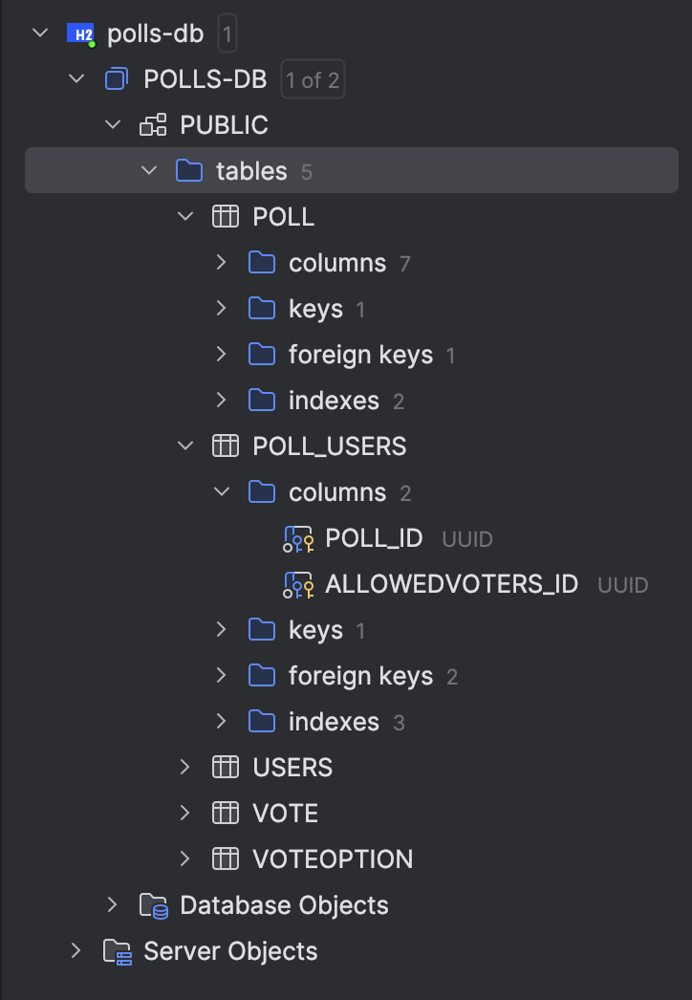

# Report

[GitHub repository](https://github.com/Matejvvo/hvl-dat-250-pollapp/)

[GitHub: frontend](https://github.com/Matejvvo/hvl-dat-250-pollapp/tree/main/frontend) 

[GitHub: backend](https://github.com/Matejvvo/hvl-dat-250-pollapp/tree/main/backend)

[GitHub: backend tests](https://github.com/Matejvvo/hvl-dat-250-pollapp/tree/main/backend/src/test/java/no/hvl/dat250/pollapp)

I was done with this assignment the quickest. And I did not run into any major issues.

I successfully imported the dependencies and added the provided testing code and all looked correct set up.

Then I added the `@OneToMany` and `@ManyToOne` annotations to all the class association attributes. However, I forgot about `Set<User> allowedUsers` attribute in `Poll` which gave me a few tries to fix, before I noticed. I added `@ManyToMany` and let it automatically create the join table and its fields. Lastly H2 reservers the keyword `User` os I had to rename the table e.g. to `users`. Then all the tests passed.

To inspect the db, I switched from in memory representation to a file storage: `.property(PersistenceConfiguration.JDBC_URL, "jdbc:h2:file:./polls-db")`. Then I imported it to `IDEA` to inspect the tables. 

In total, 5 tables were created: `POLL`, `USERS`, `VOTE`, `VOTEOPTION` and the join table `POLL_USERS`. Each table has its corresponding attributes and only the `IDs` were renamed to `TABLE_ID`.

In my own time, I will maybe try to implement the H2 database into the project completely and correctly.
